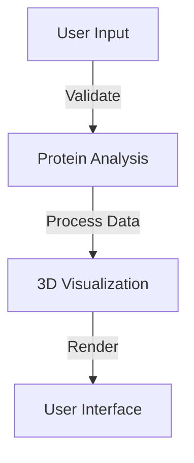

# 📡 Protein Analysis & Visualization

An open-source web application for analyzing and visualizing protein structures using 3D rendering. Built with **Next.js**, **React Three Fiber**, and **Tailwind CSS**.

## 🚀 Features
- 🧬 **Protein Analysis**: Validate and analyze protein sequences
- 🎨 **3D Visualization**: Interactive molecular viewer
- 🔬 **AI-Powered Insights**: Predictive analysis (local models supported)
- 🛠 **Customization**: Configurable visualization settings
- 🌐 **Open Source**: No API key required!

---

## 📥 Installation

### 1. Clone the repository
```bash
git clone https://github.com/yourusername/protein-visualizer.git
cd protein-visualizer
```

### 2. Install dependencies
```bash
npm install
# or
yarn install
```

### 3. Start the development server
```bash
npm run dev
# or
yarn dev
```

---

## ⚙️ Configuration (Optional)

If you'd like to customize settings, create a `.env.local` file:

```plaintext
# Optional settings
NEXT_PUBLIC_API_URL=https://your-custom-api.com
NEXT_PUBLIC_ENABLE_ANALYTICS=false
NEXT_PUBLIC_DEBUG_MODE=true
```

---

## 💻 Usage

### 🧬 Basic Protein Analysis

```typescript
import { analyzeProtein } from '@/actions/analyze'

const result = await analyzeProtein('MAEGEITTFTALTEKFNLPPGNYKKPKLLYCSNG')
console.log(result)
```

#### Example Output
```json
{
  "location": "Cytoplasm",
  "confidence": "High",
  "compartments": ["Mitochondria", "Nucleus"],
  "interactions": "Binds to ATPase",
  "signals": "Phosphorylation site detected"
}
```

### 🎨 Custom Visualization

```typescript
import { MoleculeViewer } from '@/components/molecule-viewer'

<MoleculeViewer
  sequence={proteinSequence}
  config={{
    particleCount: 3000,
    glowIntensity: 0.3,
    rotationSpeed: 0.5,
    backgroundColor: "#000000"
  }}
/>
```

---

## 🏗 Architecture

### 🖥 System Overview


### 📁 Folder Structure
```plaintext
protein-visualizer/
├── app/
│   ├── analysis/
│   │   └── page.tsx
│   ├── layout.tsx
│   └── page.tsx
├── components/
│   ├── visualization/
│   │   ├── molecule-viewer.tsx
│   │   ├── controls.tsx
│   │   └── particles.tsx
├── lib/
│   ├── utils.ts
│   └── constants.ts
├── styles/
│   └── globals.css
└── public/
    └── assets/
```

---

## 🛠 Development

### Commands
```bash
# Start development server
npm run dev

# Build production
npm run build

# Run tests
npm run test

# Lint code
npm run lint

# Format code
npm run format
```

### 🧪 Testing
```bash
npm test
npm test -- components/molecule-viewer.test.tsx --watch
```

---

## 🎨 Styling Guidelines

We use **Tailwind CSS** for styling.

```typescript
const Component = () => {
  return (
    <div className="
      flex flex-col items-center
      space-y-4 p-6
      bg-black/40 text-[#d3594d]/80
      border border-[#d3594d]/20
      backdrop-blur-sm
    ">
      {/* Content */}
    </div>
  )
}
```

---

## 🤝 Contributing

We welcome contributions! To contribute:

1. Fork the repository
2. Create a feature branch
```bash
git checkout -b feature/AmazingFeature
```
3. Commit your changes
```bash
git commit -m 'Add some AmazingFeature'
```
4. Push to the branch
```bash
git push origin feature/AmazingFeature
```
5. Open a Pull Request

### Contribution Guidelines
- Follow existing code style
- Add tests for new features
- Update documentation
- Write meaningful commit messages

---

## 📄 License
Distributed under the **MIT License**. See `LICENSE` for details.

## 📧 Contact
Your Name - [@BioFusionAgent](https://x.com/BioFusionAgent) 

Project Link: [https://github.com/yourusername/protein-visualizer](https://github.com/yourusername/protein-visualizer)

## 🙏 Acknowledgments
- [Three.js](https://threejs.org) for 3D rendering
- [Next.js](https://nextjs.org) for the framework
- [Shadcn/UI](https://ui.shadcn.com) for UI components
- [Tailwind CSS](https://tailwindcss.com) for styling
- [React Three Fiber](https://docs.pmnd.rs/react-three-fiber) for rendering 3D models
